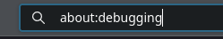
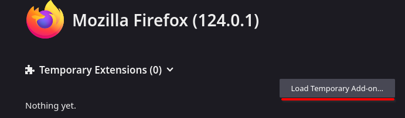
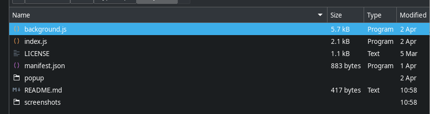

# Easy test

### Аддон для решения тестов

### Как установить:

-   Отркыть firefox

-   Открыть странцу about:debugging

-   Кликнуть "This firefox"

-   Нажать "Load Temporary add-on"

-   Выбрать любой js файл

