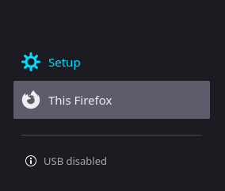

# Easy test

### Аддон для решения тестов

### Как установить:

-   Отркыть firefox

-   Открыть странцу about:debugging

-   Кликнуть "This firefox"

-   Нажать "Load Temporary add-on"

-   Выбрать любой js файл

### Как пользоваться

- Выбрать аддон из списка аддонов

- Вставить json-файл с ответами

- Нажать кнопку upload

Если вы всё сделали верно - появится надпись об успешной добавке ответов

После этого, наведите на вопрос и по сочетанию клавиш `Ctrl-Alt-P` в нижнем левом углу появится ответ
